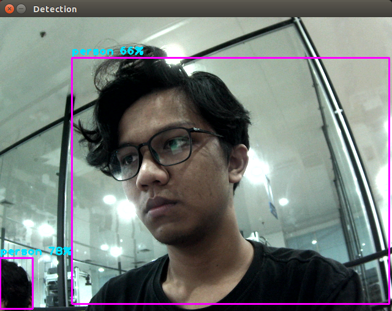

# 🚀 YOLOv5 on Jetson Nano (Real-time Webcam Inference)

This repository demonstrates how to implement **YOLOv5** on a **Jetson Nano** for real-time object detection using a webcam.  

## 🔗 Reference  
The core implementation is based on the amazing [tensorrtx](https://github.com/wang-xinyu/tensorrtx/tree/master/yolov5) by **wang-xinyu**.  

## 🛠 Setup & Model Conversion  
Follow the step-by-step guide from the original repo to convert your `.pt` model into a `.engine` (TensorRT format).  

✅ **Tested on:**  
- **Jetson Nano** with **JetPack 4.6.6**  

## 🎥 Real-time Inference  
Once you have the `.engine` model, you can use this repository to run real-time object detection with your webcam on **Jetson Nano**.  

### 🚀 Get Started  
#### 1. Clone this repo  
```bash
git clone https://github.com/dsyahput/Yolov5_Jetson-Nano.git
cd Yolov5_Jetson-Nano
```
#### 2. build the code
Before building the code, modify `main.cpp` to update the model path and classnames path based on your configuration.

Then, run the following commands:
```
mkdir build
cd build
cmake ..
make
```
#### 3.  Run the code
```
./detect
```

🖼️ **Results**




